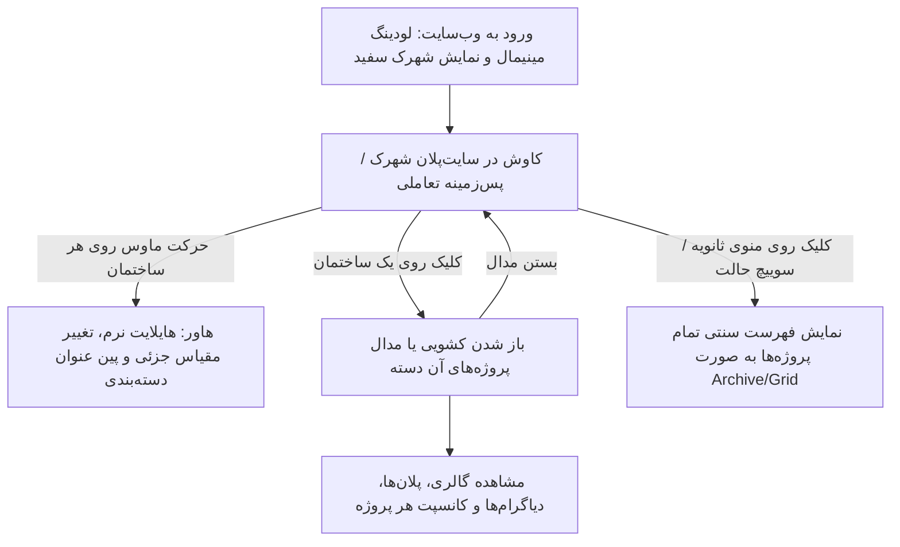

# سند نیازمندی‌های محصول (PRD)
## وب‌سایت پورتفولیو و گالری تعاملی معماری (Minimal White Architectural City)

---

### ۱. معرفی و چشم‌انداز محصول (Product Overview & Vision)
این وب‌سایت یک **پورتفولیو و وب‌سایت پرزنتیشن تعاملی معماری** است که ساختار سنتی وب‌سایت‌های پورتفولیو (شبکه‌ای از عکس‌ها) را با یک **ماکت شهری مینیمال، سفید و سه‌بعدی (White Clay Architectural Model / Masterplan)** جایگزین می‌کند.

* **ایده کلیدی:** کل وب‌سایت در صفحه نخست به صورت یک محوطه یا شهرک معماری مدرن، خالص و مینیمال (رندر سفید/خاکستری روشن بدون تکسچرهای سنگین با نورپردازی و سایه‌های نرم) نمایش داده می‌شود.
* **ساختمان‌ها به عنوان دسته‌بندی:** هر ساختمان موجود در این سایت‌پلان معرف یک کاربری و دسته‌بندی از پروژه‌ها است (مانند: ویلا، آپارتمان/مسکونی، تجاری، فروشگاه/مغازه، اداری/عمومی).
* **تعویض آسان المان‌ها:** سیستم باید کامپوننت‌محور و مبتنی بر کانفیگ (Data-Driven) باشد تا بتوان بدون تغییر در کدهای اصلی، تصویر پس‌زمینه، عکس‌های برش‌خورده‌ی ساختمان‌ها، مختصات هاور/کلیک و لیست پروژه‌ها را به راحتی به‌روزرسانی یا تعویض کرد.

---

### ۲. هویت بصری و استایل دیزاین (Design Language & Aesthetics)
1. **پالت رنگی:** 
   * رنگ‌های پایه: سفید خالص (`#FFFFFF`)، خاکستری ماکتی نرم (`#F4F4F6` ، `#EAEAEA`)، سایه‌های محیطی لطیف (`rgba(0,0,0,0.06)`).
   * رنگ اکسنت (Accent): مشکی شارپ برای تایپوگرافی (`#111111`) و یک رنگ هایلایت بسیار ملایم یا کانتور نوری ظریف در زمان هاور (مثل خطوط روشن یا نور نئونی بسیار مینیمال).
2. **سبک رندر:** معماری Clay Render / White Maquette با زاویه دید ایزومتریک یا پرسپکتیو چشم ناظر/دید پرنده (مشابه رفرنس ارائه شده).
3. **تایپوگرافی:** فونت‌های مدرن، تمیز و مینیمال (مانند Vazirmatn / Inter / Neue Haas Grotesk) با چیدمان مینیمال کاتالوگی.
4. **حس کاربری:** شبیه ایستادن جلوی یک ماکت فیزیکی لوکس در یک بی‌ینال یا آتلیه معماری معتبر.

---

### ۳. ساختار و دسته‌بندی‌ها (Categories & Mapping)
شهرک تعاملی شامل چندین زون/ساختمان شاخص خواهد بود که هر کدام نماینده یک تایپولوژی معماری هستند:

| ساختمان در رندر / شهرک | دسته‌بندی معماری | نمونه پروژه‌ها |
| :--- | :--- | :--- |
| **ساختمان ویلایی (Villa Volume)** | پروژه‌های ویلایی و تک‌واحدی | ویلاهای مدرن، خانه‌های حومه‌ای، کلبه‌های مینیمال |
| **برج / مجتمع مسکونی (Apartment Block)** | آپارتمان‌ها و مجتمع‌های مسکونی | برج‌های مسکونی، آپارتمان‌های لوکس شهری |
| **مجتمع تجاری (Commercial Complex)** | تجاری و اداری | مراکز تجاری، ساختمان‌های اداری، دفاتر کار مدرن |
| **بوتیک / فروشگاه (Retail & Store)** | فروشگاه‌ها و شوروم‌ها | طراحی داخلی فروشگاه، بوتیک‌ها، کافه‌ها |
| **المان عمومی / فرهنگی (Public / Cultural)** | کانسپت‌ها، فضاهای فرهنگی یا پاویون‌ها | پاویون، گالری هنری، پروژه‌های تحقیقاتی مسابقات |

---

### ۴. فلو و رفتار تعاملی کاربر (User Flow & Interactions)



#### ۴.۱. صفحه اصلی (Interactive Maquette Canvas):
* تصویر/رندر پس‌زمینه به شکل تمام‌صفحه یا در یک کادر لوکس با نسبت ابعاد متناسب قرار دارد.
* هر ساختمان دارای لایه‌ی تعاملی (Interactive Hotspot / Cutout / Pin) است.
* **رفتار ماوس (Hover):** با قرار گرفتن ماوس روی هر ساختمان:
  * خطوط یا لایه ساختمان کمی برجسته و هایلایت می‌شود.
  * یک تگ شناور شیشه‌ای (Glassmorphic Minimal Badge) نام دسته‌بندی و تعداد پروژه‌ها را نشان می‌دهد (مثال: `01 / Residential Villas — 4 Projects`).
  * صدای کلیک یا فیدبک لمسی بسیار ظریف (اختیاری).

#### ۴.۲. باز شدن جزئیات پروژه‌ها (Project Drawer / Modal):
* با کلیک روی هر ساختمان، یک پنل کشویی از بغل (Slide-over Drawer) یا یک مدال مینیمال تمام‌صفحه با انیمیشن روان باز می‌شود.
* محتوای پنل:
  * عنوان دسته‌بندی و معرفی کوتاه کانسپت.
  * کارت‌های پروژه‌های مربوط به آن دسته شامل:
    * تصویر کاور پروژه (با افکت بزرگنمایی هنگام هاور).
    * نام پروژه، سال ساخت، موقعیت مکانی و متراژ.
    * دکمه مشاهده گالری کامل و دیاگرام‌ها/پلان‌ها (Floor plans, Section, Concept sketches).

#### ۴.۳. قابلیت‌های تکمیلی (Header & Footer UI):
* **هدر مینیمال:** نام برند / معمار (Studio Name)، دکمه سوییچ به نمای لیستی (Index / List View)، درباره ما (About) و تماس (Contact).
* **سیستم ناوبری جایگزین (Accessibility):** یک نوار ابزار پایین صفحه که به کاربر امکان می‌دهد بدون کلیک روی ماکت نیز بین دسته‌ها سوییچ کند.

---

### ۵. معماری فنی و ماژولار بودن (Technical Architecture)

#### ۵.۱. ساختار لایه‌ای پس‌زمینه و دکمه‌های ساختمانی (Layered Hotspot Architecture)
برای اینکه تغییر و جایگزینی ساختمان‌ها فقط با یک عکس و بدون دستکاری پیچیده کد انجام شود، از معماری دو لایه استفاده می‌کنیم:
1. **لایه ۱ (Base Canvas / Background):** تصویر اصلی رندر شهرک سفید (`background.webp` یا `background.jpg`).
2. **لایه ۲ (Building Hotspots / Cutouts):** 
   * هر ساختمان دارای یک تصویر شفاف (PNG/WebP Cutout) یا یک محدوده چندضلعی/نشانگر (SVG / CSS Percentage Coords) است.
   * برای تعویض ساختمان، کافیست تصویر ساختمان جدید را در پوشه `assets/buildings/` جایگزین کنید یا تصویر پس‌زمینه و موقعیت درصد x, y آن را در فایل کانفیگ تغییر دهید.

#### ۵.۲. ساختار فایل کانفیگ داده‌ها (`projectsData.json` / `config.ts`)
```json
{
  "categories": [
    {
      "id": "villas",
      "title": "پروژه‌های ویلایی",
      "subtitle": "Residential / Villas",
      "buildingImage": "/assets/buildings/villa-hotspot.png",
      "position": { "top": "45%", "left": "30%", "width": "18%" },
      "projects": [
        {
          "id": "villa-damavand",
          "title": "ویلای دماوند",
          "location": "دماوند، تهران",
          "year": "2024",
          "area": "650 متر مربع",
          "coverImage": "/assets/projects/damavand-1.jpg",
          "gallery": ["/assets/projects/damavand-1.jpg", "/assets/projects/damavand-2.jpg"],
          "description": "طراحی ویلای معلق با بتن اکسپوز و پنجره‌های سرتاسری..."
        }
      ]
    }
  ]
}
```

#### ۵.۳. پشته فناوری پیشنهادی (Recommended Tech Stack):
* **Core:** React 18 / Next.js یا Vite + React (جهت سرعت لود آنی و سبک بودن).
* **Styling:** Tailwind CSS (طراحی مدرن، مینیمال و کلاس‌های تمیز).
* **Animations:** Framer Motion (انیمیشن‌های نرم حرکتی، باز و بسته شدن پنل‌ها).
* **Icons:** Lucide React (آیکون‌های خطی فوق باریک مناسب معماری).
* **Responsive Support:** مناسب برای دسکتاپ، تبلت و موبایل (در موبایل علاوه بر شهرک، حالت لمسی و منوی کشویی هم اضافه می‌شود).

---

### ۶. ویژگی‌های کلیدی درخواستی (Specific Key Requirements)
1. **رندر سفید و مینیمال (Clay Render View):** بدون شلوغی، با پس‌زمینه خلوت و مدرن مطابق رفرنس Dreamstime.
2. **تفکیک عملکردی ساختمان‌ها:** هر ساختمان به عنوان دکمه مستقل برای باز کردن لیست پروژه‌های آن دسته.
3. **انعطاف در پس‌زمینه و تصاویر:** امکان تعویض عکس پس‌زمینه یا دکمه‌های ساختمانی به راحتی از طریق پوشه تصاویر و فایل کانفیگ.
4. **طراحی دوزبانه یا آماده برای انگلیسی/فارسی:** ساختار استاندارد برای نام‌گذاری پروژه‌ها.

---

### ۷. فازبندی و مراحل پیاده‌سازی (Implementation Roadmap)
* **فاز ۱:** تایید PRD و ساختار کلی و نیازمندی‌ها (همین سند).
* **فاز ۲:** ساخت بستر اولیه پروژه (راه‌اندازی پروژه با React + Vite + Tailwind + Framer Motion).
* **فاز ۳:** طراحی کامپوننت شهرک تعاملی (Interactive Maquette Canvas) با لایه‌بندی ماژولار و پین‌های هاور هوشمند.
* **فاز ۴:** ساخت پنل کشویی پروژه‌ها (Project Drawer) و پاپ‌آپ مشاهده گالری و اطلاعات پروژه.
* **فاز ۵:** اضافه کردن سیستم تعویض آسان عکس پس‌زمینه و دکمه‌ها و تست ریسپانسیو.
